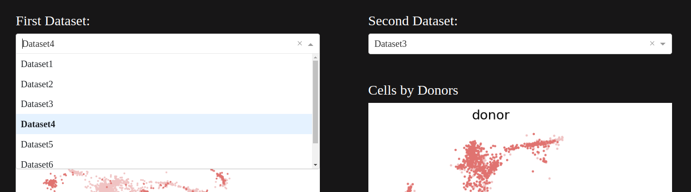

# Large-scale differential gene expression analysis in scRNA-seq data

Is a project proposed by [Dr. Anne Hartebrodt](https://www.bionets.tf.fau.de/person/anne-hartebrodt/) and [Prof. Dr. David B. Blumenthal](https://www.bionets.tf.fau.de/person/david-b-blumenthal/) at the [BIONETS](https://www.bionets.tf.fau.de/) at FAU.

This project goals are:

- Retrieve scRNA-seq data from case-control studies for one fixed disease.
- Run pipelines for
    - Clustering and cell type annotation
    - Identification of DEGs, comparing cells from the same cell type between case and control.
- Make a web-app to interactively visualize the results.
- (Possibly) Extend to > 1 diseases.

This project consists of ***two*** parts:

1. scRNA-seq Analysis
    - Which consists of disease research, data collection, cell type annotation, and DEG
2. Preparing a web-based template to demonstrate the finding
    - Which should be interactive and easy to use.

## Part I - scRNA-seq Analysis
As the main part of the project, this section consists of most of the work. We tried to create a pipeline, to which we feed the datasets of a disease and retrieve the results as `csv` files and plots.

### Input Specific Pipeline
As there are multiple types of file formats, in which we can store different types of scRNA-seq data, we decided to continue with `10x-genomics` format.
To work with such a technique, it is required to prepare datasets is a specific format, shown below:

    BioNet
    ├── Cell_Annotation_and_DGE
    │    ├── CellType_Annotation_with_DEG_Pipeline.ipynb
    │    └── data
    │        ├── Disease Name 1 (e.g. Diabetes II)
    │        │   └── Dataset 1
    │        │       ├── Case 1
    │        │       │   ├── barcodes.tsv.gz
    │        │       │   ├── features.tsv.gz
    │        │       │   └── matrix.mtx.gz
    │        │       └── Control 1
    │        │           ├── barcodes.tsv.gz
    │        │           ├── features.tsv.gz
    │        │           └── matrix.mtx.gz
    │        │
    │        └── Disease Name 2 (e.g. MPN)
    │            └── Dataset 1
    │                 ├── Case 1
    │                 │   ├── barcodes.tsv.gz
    │                 │   ├── features.tsv.gz
    │                 │   └── matrix.mtx.gz
    │                 └── Control 1
    │                     ├── barcodes.tsv.gz
    │                     ├── features.tsv.gz
    │                     └── matrix.mtx.gz
    │
    ├── WebApplication
    └── etc.

## Images of Project
### Disease Selection and Introduction
Here you can select the disease type, based on which, the datasets will be updated.


### Dataset Selection
Here you can select the dataset you want to work on, based on which, the plots and table will be updated.



### Cell by Donors


### Leiden Clustering over data


### Cell Type Annotation using SCSA over CellMarker database


### Cell Type Annotation using SCSA over Panglaodb database


### Cell Embeddings


### Ro/e


### Differential Gene Expression Tables


### Preprocessing AnnData
In process

### Cell Type Annotation
In process

### Ro/e Calculation
In process

### DEG Calculation
In process

## Part II
### Web Application
In process

### Features
In process

## Conclusion
In process

## Future Goals
- [ ] Writing the README.md file

## How to run
To run the web application:

```bash
git clone https://github.com/FarzamTP/BioNet.git
cd BioNet
python3 -m venv venv
source venv/bin/activate
pip install -r requirements.txt
```

### Running the Dash Application
```bash
cd WebApplication
python3 app.py
```

Then you can visit ```http://127.0.0.1:8050``` to open the application locally.
