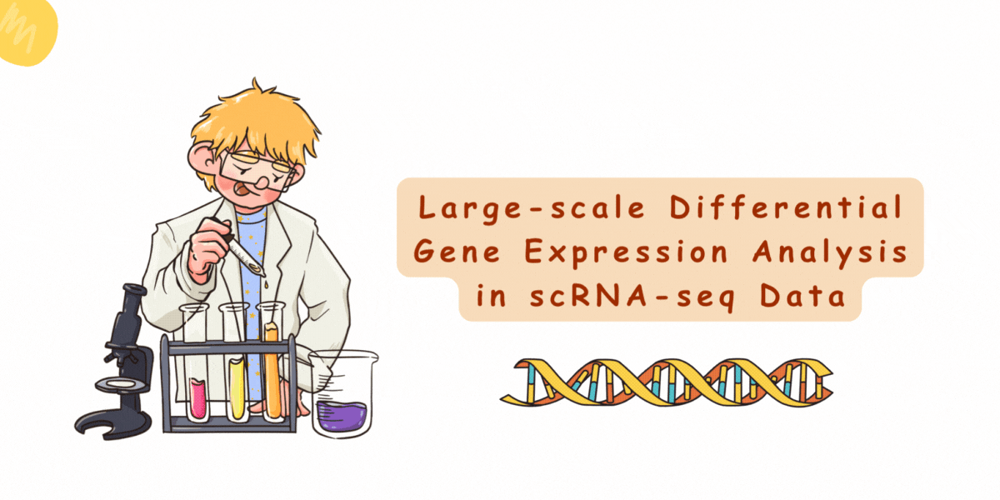

> _**Disclaimer:** All necessary files, including data, documents, pipelines, etc, for the BioNets Project are the intellectual property of Biomedical Network Science ([BIONETS](https://www.bionets.tf.fau.de/)) lab at [FAU Erlangen-Nürnberg](https://www.fau.eu/). Please be aware that copying content from here holds you accountable._



Welcome to the Biomedical Network Science (BioNets) Project repository for the Winter'23/24 semester at [Friedrich-Alexander University Erlangen-Nürnberg](https://www.fau.eu/). This repository contains necessary files and documents for the BioNets project called **"Large-scale Differential Gene Expression Analysis in scRNA-seq Data"**, proposed by the Biomedical Network Science ([BIONETS](https://www.bionets.tf.fau.de/)) lab, supervised by [Prof. Dr. David B. Blumenthal](https://www.bionets.tf.fau.de/person/david-b-blumenthal/) and [Dr. Anne Hartebrodt](https://www.bionets.tf.fau.de/person/anne-hartebrodt/) at FAU Erlangen-Nürnberg.

## Project Contributors

- [Farzam Taghipour](https://www.linkedin.com/in/farzamtaghipour/), Graduate Student in Artificial Intelligence at FAU Erlangen-Nürnberg
- [Sujit Debnath](https://www.linkedin.com/in/sujit-debnath/), Graduate Student in Artificial Intelligence at FAU Erlangen-Nürnberg

## Project Goals

The core goals of the project are as follows:

- Retrieve scRNA-seq data from case-control studies for one fixed disease.
- Implemented and run pipelines for
 - Clustering and automatic cell type annotation.
 - Identification of DEGs, comparing cells from the same cell type between case and control.
- Make a dashboard to visualize the results interactively.
- (Possibly) Extend to > 1 diseases.

This project consists of _**two**_ parts:

1. **scRNA-seq Analysis:** This includes disease research, relevant data collection, automatic cell type annotation, and differentially expressed genes (DEGs) analysis.
2. **Dashboard:** Prepare a web-based template to demonstrate the findings, which should be interactive and easy to use.

## Project Structure

```bash
fau-bionets-project-ws23
├── dataset/                            # Data directory
│   ├── disease_id1/                    # Disease Name 1, e.g. Diabetes II
│   │   ├── dataset_id1/                # Dataset 1 for disease 1
│   │   │   ├── case/                   # Case samples
│   │   │   │   ├── barcodes.tsv.gz
│   │   │   │   ├── features.tsv.gz
│   │   │   │   └── matrix.mtx.gz
│   │   │   └── control/                # Control samples
│   │   │       ├── barcodes.tsv.gz
│   │   │       ├── features.tsv.gz
│   │   │       └── matrix.mtx.gz
│   │   ├── dataset_id2/
│   │   └── ...
│   ├── disease_id2/                    # Disease Name 2, e.g. MPN
│   └── ...
├── pipelines/                          # Main pipeline modules
│   ├── services/                       # Pipeline services
│   │   ├── adata_handler.py            # Script for data loading, saving, etc
│   │   ├── adata_preprocessor.py       # Script for preprocessing
│   │   ├── cell_type_annotation.py     # Script for automatic cell annotation
│   │   └── diff_gene_exp_analysis.py   # Script for DGE analysis
│   ├── summary_cell_anno.py            # Script for generating summary results
│   ├── run_pipelines.sh                # Script for running the whole pipeline
│   └── cleaner.sh                      # Script for cleaning temporary files (optional)
├── results/                            # Results directory
│   ├── summary/                        # Summary results directory
│   ├── disease_id1/                    # Results directory of Disease 1
│   │   ├── dataset_id1/                # Store results of dataset1
│   │   ├── dataset_id2/                # Store results of dataset2
│   │   └── ...
│   ├── disease_id2/                    # Results directory of Disease 2
│   └── ...
├── dashboard/                          # Streamlit Dashboard directory
│   ├── .streamlit/                     # Contains Streamlit config file
│   ├── pages/                          # Contains pages of Dashboard
│   │   ├── 1_Summary.py                # Summary page of Dashboard
│   │   ├── 2_Individual_Results.py     # Individual results page of Dashboard
│   │   └── 3_Comparison.py             # Comparison page of Dashboard
│   └── _Home.py                        # Home page of Dashboard
├── docs/                               # Documents directory for snapshots, videos, etc
│   ├── assets/                         # Contains readme assets
│   ├── presentation/                   # Contains presentation files
│   └── report/                         # Contains report files
└── README.md                           # Project documentation
```

## Project Details

### 1. Dataset
Two data sources of two diseases, such as type II Diabetes Mellitus and Myeloproliferative Neoplasm (MPN), have been obtained from the [Gene Expression Omnibus](https://www.ncbi.nlm.nih.gov/geo/) repository. Details are as follows,

- **Diabetes Mellitus Type II:** This dataset investigates systemic immunological modifications caused by type 2 diabetes mellitus (DM) in patients diagnosed with periodontitis (PD). The research, conducted via single-cell RNA sequencing (scRNA-seq) analysis of peripheral blood mononuclear cells (PBMCs), aims to compare the immune response between patients with PD only and those with both PD and DM (PDDM). Through this study, researchers seek to enhance understanding of the complex immunological relationships between PD and DM. Sample distribution: _11 healthy control subjects, 10 patients with PD without DM, and 6 patients with PDDM_. [[source-url](https://www.ncbi.nlm.nih.gov/geo/query/acc.cgi?acc=GSE244515)]

- **Myeloproliferative Neoplasm (MPN):** This dataset encompasses a comprehensive analysis of platelets derived from patients diagnosed with MPNs, particularly essential thrombocythemia (ET). The study, conducted by researchers, revealed significant metabolic alterations mediating aberrant platelet activity and inflammation in MPNs through single-cell RNA sequencing (scRNA-Seq) analysis of primary PBMC samples. Notably, transcripts related to platelet activation, mTOR, and oxidative phosphorylation (OXPHOS) were found to be enriched in ET platelets. [[source-url](https://www.ncbi.nlm.nih.gov/geo/query/acc.cgi?acc=GSE244589)]

In both of them, the experiment involved Homo sapiens as the organism and utilized expression profiling by high throughput sequencing as the primary experimental method. Case vs. Control datasets for each disease were prepared by categorizing individuals into two groups: cases and controls. Cases consisted of individuals diagnosed with the respective disease (MPNs or Diabetes II), while controls comprised individuals without the disease. This stratification allowed for comparative analysis between the two groups to identify disease-associated features and patterns within the scRNA-seq data.

### 2. Pipelines
The overall pipeline consists of **three key stages**: (i) preprocessing adata, (ii) automatic cell-type annotation, and (iii) differential gene expression (DGE) analysis. These stages are designed to process single-cell RNA sequencing (scRNA-seq) data, annotate cell types, and identify differentially expressed genes associated with case vs control dataset for a specific disease. However, the overall pipelines are managed and executed using the `run_pipelines.sh` script [[script-url](./pipelines/run_pipelines.sh)]. Please refer to the environment setup section for detailed instructions on running the pipelines.

#### 2.1. Preprocessing anndata
The preprocessing pipeline applies quantity control to filter low-quality observations based on thresholds for mitochondrial gene expression, UMIs, and detected genes. It then normalizes the data using logarithmic transformation and Pearson correlation, selects highly variable genes, and performs principal component analysis (PCA) for dimensionality reduction. Finally, it constructs a neighbourhood graph for visualization and applies clustering methods such as Leiden to identify cell populations. [[script-url](./pipelines/services/adata_preprocessor.py)]

#### 2.2. Automatic Cell-type Annotation
In this stage, automatic cell type annotation has been performed using two methods: SCSA and MetaTiME.

- **SCSA:** SCSA is an automatic tool for annotating cell types from scRNA-seq data. It employs a score annotation model that combines differentially expressed genes (DEGs) and confidence levels of cell markers from both known and user-defined information. This method eliminates the need for manual strategies, providing consistent and precise cell-type annotations. Evaluation of real scRNA-seq datasets demonstrates SCSA's ability to assign cells to correct types with desirable precision. [[original-paper](https://www.frontiersin.org/journals/genetics/articles/10.3389/fgene.2020.00490/full)]

- **MetaTiME:** MetaTiME is another method utilized for automatic cell type annotation. It uses pre-trained MeC models and functional annotations to project single cells into MeC space, where cell states are annotated based on MeC scores. This approach enables fine-grained cell state annotation, facilitating a deeper understanding of the cellular composition of complex tissues and environments. [[original-paper](https://www.nature.com/articles/s41467-023-38333-8)]

After annotated cell types using SCSA and MetaTiME, they are then visualized using embeddings such as UMAP. Additionally, the Ratio of Observed to Expected cell numbers (Ro/e) is calculated to quantify the tissue preferences of each cluster, if applicable. [[script-url](./pipelines/services/cell_type_annotation.py)]

#### 2.3. DGE Analysis
The differential gene expression (DGE) analysis pipeline performs gene expression analysis using various methods such as _**t-test, Wilcoxon rank-sum, logistic regression, and t-test with overestimated variance**_. It ranks genes based on their expression differences between groups (e.g., case vs. control) for each donor. The results are stored in a CSV file containing information such as gene names, target cell types, donors, method used, scores, adjusted p-values, and log-fold changes. This analysis aids in identifying genes associated with specific cell types in the context of different diseases. [[script-url](./pipelines/services/diff_gene_exp_analysis.py)]

### 3. Dashboard
Our project features a dynamic dashboard built on [Streamlit](https://streamlit.io), offering multiple functionalities.

- **Homepage:** Welcome screen providing an overview of the project and its objectives.
- **Individual Results Showcase:** Detailed results displayed for each dataset.
- **Comparison Functionality:** Enables users to compare results across datasets for each disease.
- **Interactive Summary Results:** Summarized overview of key findings.

Check out a video demonstration of our dashboard below:

https://github.com/sujitdebnath/fau-bionets-project-ws23/assets/47503518/11b5f0d8-a1a8-4649-b67f-377f7c8ecbbe

### 4. Results
In this section, we present the outcomes of our team project, which consists of two significant components: automatic cell annotation and DGE Analysis. For further details, please refer to our presentation slides available [here](./docs/presentation/presentation_slide.pptx) or access them via Google Slides [here](https://docs.google.com/presentation/d/18BIoMRegnRVYEGkMIPnDYuD5Apvs-wQcIb0sJqPO0b0/edit?usp=share_link). Additionally, our comprehensive report can be accessed [here](./docs/report/report.pdf).

#### 4.1. Automatic Cell Annotation

**Distribution for Case vs Control:** The figure below represents the distribution of cell types in case vs control datasets for Diabetes Type 2 (a-c) and MPN diseases (d-f), annotated using different cell annotation methods. Specifically, (a) and (d) represent SCSA with cellmarker, (b) and (e) represent SCSA with panglaodb, (c) and (f) depict MetaTiME annotations.


**Distribution According to Annotation Methods:** The figure below demonstrates the distribution of cell types according to all annotation methods for Type 2 Diabetes (a) and Myeloproliferative Neoplasm (MPN) diseases (b).


**Cell Type Co-occurrence For All Diseases:** The figure below unveils the cell type co-occurrence heatmap for Diabetes Type 2 (a-c) and MPN diseases (d-f). Specifically, (a) and (d) represent SCSA - cellmarker vs SCSA - panglaodb, (b) and (e) represent SCSA - cellmarker vs MetaTiME, (c) and (f) depict SCSA - panglaodb vs MetaTiME.


## Environment Setup

This section provides step-by-step instructions for setting up the required environment on Linux or MacOS systems. Please note that the setup process for MacOS systems with Silicon-based processors may vary slightly.

### Used Technology
1. [Python3.x](https://www.python.org), and [Anaconda](https://anaconda.org) distribution (for Silicon-Based MacOS)
2. [Scanpy](https://scanpy.readthedocs.io/en/stable/) - it is a Python package and a scalable toolkit for analyzing single-cell gene expression data built jointly with [anndata](https://anndata.readthedocs.io/en/latest/).
3. [Omicverse](https://omicverse.readthedocs.io/en/latest/) - Omicverse is the fundamental package for multi-omics, including bulk and scRNA-seq analysis with Python.
4. [Streamlit](https://streamlit.io) - Streamlit is a promising open-source Python library which enables developers to build attractive user interfaces in no time.

### Linux

```bash
# Create a virtual environment and activate
python3 -m venv <env_name>
source <env_name>/bin/activate

# Upgrade pip
pip install --upgrade pip

# Install required Python packages
pip install pandas numpy scipy scikit-learn seaborn matplotlib jupyter openpyxl scanpy anndata leidenalg louvain plotly

# Install PyTorch, PyTorch Geometric and additional packages for CPU-only operations
pip install torch===2.0.0 torchvision torchaudio --index-url https://download.pytorch.org/whl/cpu
pip install torch_geometric
pip install pyg_lib torch_scatter torch_sparse torch_cluster torch_spline_conv -f https://data.pyg.org/whl/torch-2.1.0+cpu.html

# Install Omicverse package
pip install -U omicverse

# Install Streamlit for Dashboard
pip install streamlit

# [if needed] Deactivate and remove virtual environment
deactivate
rm -rf <env_name>
```

### MacOS (Silicon Based)

```bash
# Create a conda environment and activate
conda create -n <conda_env_name> python=<python_version>
conda activate <conda_env_name>

# Install required Python packages
conda install -c conda-forge pandas numpy scipy scikit-learn seaborn matplotlib jupyterlab scanpy anndata pymde python-igraph leidenalg
pip install louvain plotly

# Install PyTorch, PyTorch Geometric and additional packages for CPU-only operations
conda install pytorch torchvision torchaudio cpuonly -c pytorch
pip install torch_geometric
conda install s_gd2 -c conda-forge

# Install Omicverse package
pip install -U omicverse

# Install Streamlit for Dashboard
conda install -c conda-forge streamlit

# [if needed] Deactivate and remove conda environment
conda deactivate
conda remove -n <conda_env_name> --all
```

### Run the Project

```bash
# Clone the repository
git clone git@github.com:sujitdebnath/fau-bionets-project-ws23.git
cd fau-bionets-project-ws23

# Create a venv and install everything
# and then activate virtural environment
source <env_name>/bin/activate
# or conda environment
conda activate <conda_env_name>

# Run the pipeline
cd pipelines
sh run_pipelines.sh

# Run the dashboard
streamlit run dashboard/_Home.py
# or
python3 -m streamlit run dashboard/_Home.py
```

## Conclusion

The BioNets project offers comprehensive pipelines for large-scale scRNA-seq data analysis, contributing to advancements in biomedical network science. Our project facilitates more profound insights into disease mechanisms by integrating automatic cell-type annotation and differential gene expression analysis. Furthermore, the interactive dashboard promises enhanced data exploration and comparison, empowering researchers with intuitive tools for comprehensive data interpretation and hypothesis generation.

> Feel free to explore the intriguing world of Biomedical Network Science through our project repository!
